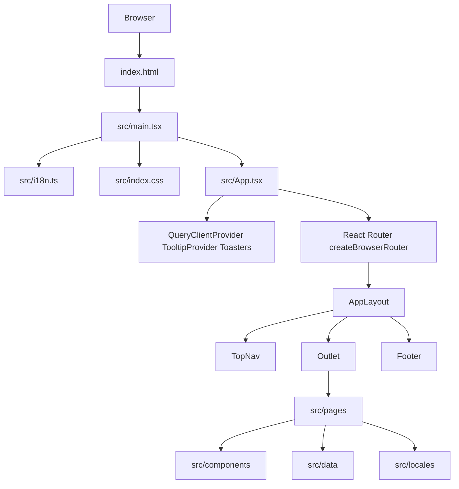
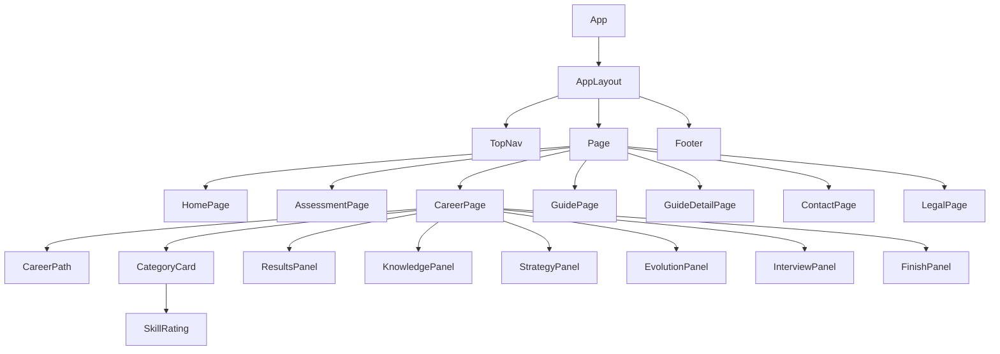
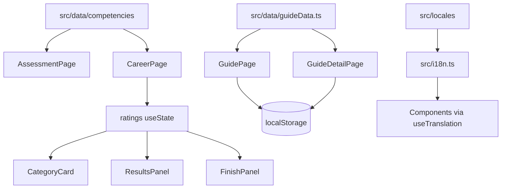
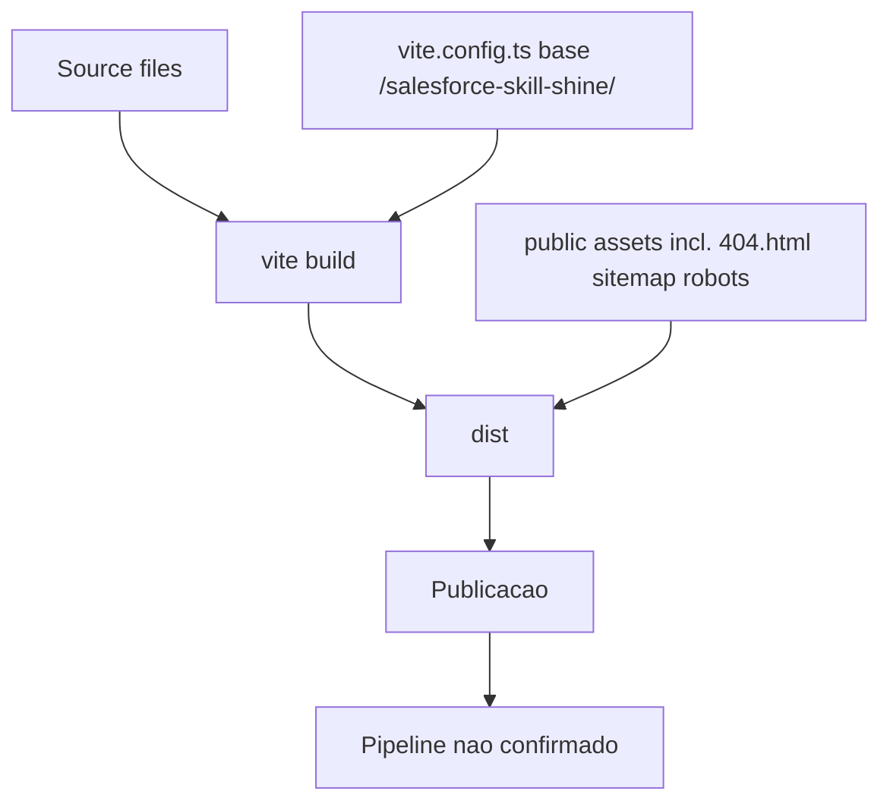

# Arquitetura

## Organização Real Encontrada

O projeto é uma SPA React com Vite, organizada por páginas, componentes reutilizáveis, dados estáticos e locales. Não há evidência suficiente para classificar a aplicação como Clean Architecture, MVC, MVVM, Atomic Design ou Feature-Sliced Design.

Evidências: `src/main.tsx`, `src/App.tsx`, `src/pages/*`, `src/components/*`, `src/data/*`, `src/locales/*`.

## Ponto de Entrada

- `index.html` declara `<div id="root">` e carrega `/src/main.tsx`.
- `src/main.tsx` importa `./i18n`, `./index.css`, cria root React e renderiza `<App />`.
- `src/App.tsx` configura providers globais, router, toasters e layout.

## Composição de Layout

- `AppLayout` envolve todas as rotas filhas com `TopNav`, `<main><Outlet /></main>` e `Footer`. Evidência: `src/components/layout/AppLayout.tsx`.
- `TopNav` contém navegação principal e seletor de idioma. Evidência: `src/components/layout/TopNav.tsx`.
- `Footer` contém links legais e canais externos. Evidência: `src/components/layout/Footer.tsx`.

## Estratégia de Rotas

- Rotas centralizadas em `src/App.tsx` usando `createBrowserRouter`.
- `basename` deriva de `import.meta.env.BASE_URL`; com `vite.config.ts`, a base publicada é `/salesforce-skill-shine/`.
- Há rota wildcard `*` com `NotFound`.
- `public/404.html` redireciona rotas diretas para `/?redirect=...`, e `index.html` processa `redirect` para restaurar a URL SPA.

## Estado Local e Global

- Provider global: `QueryClientProvider`, `TooltipProvider`, `Toaster`, `Sonner`. Evidência: `src/App.tsx`.
- Não foram encontrados `useQuery` ou `useMutation`; React Query está configurado mas sem uso de queries na busca. Evidência: busca por `useQuery|useMutation`.
- Estado local por página/componente: ratings e aba ativa em `CareerPage`; tabs, busca e guias customizados em `GuidePage`; notas e status de salvamento em `GuideDetailPage`; formulário/PDF em `FinishPanel`.

## Fluxo de Dados

- Dados estáticos de competências: `src/data/competencies/index.ts` agrega `admin`, `developer`, `consultant`, `architect`.
- Dados estáticos de guia: `src/data/guideData.ts` exporta `defaultGuides` gerado a partir de `baseGuides` e funções de enriquecimento.
- Traduções: `src/i18n.ts` importa JSONs `pt`, `en`, `es`; componentes usam `useTranslation` e helpers `getLocalizedString`.
- Persistência client-side: `GuidePage` e `GuideDetailPage` usam `localStorage` para guias customizados, aba ativa e notas.

## Tratamento de Erros

- Router usa `errorElement: <NotFound />`. Evidência: `src/App.tsx`.
- `NotFound` registra URL não encontrada no console. Evidência: `src/pages/NotFound.tsx`.
- `GuidePage` e `GuideDetailPage` capturam erro de parse de `localStorage` e registram `console.error`. Evidência: `src/pages/GuidePage.tsx`, `src/pages/GuideDetailPage.tsx`.
- `FinishPanel` captura erro na geração de PDF e exibe mensagem local. Evidência: `src/components/FinishPanel.tsx`.

## Responsividade

- Estratégia mobile-first com Tailwind (`sm:`, `md:`, `lg:`, `xl:`). Evidência: `src/pages/*`, `src/components/*`.
- Menu mobile no `TopNav` com `useState` e breakpoints `md:hidden`/`hidden md:flex`. Evidência: `src/components/layout/TopNav.tsx`.

## Temas

- Tokens CSS para `:root` e `.dark` existem em `src/index.css`.
- Tailwind tem `darkMode: ["class"]`. Evidência: `tailwind.config.ts`.
- Não foi encontrado controle global de alternância de tema na navegação principal. Uso de `next-themes` foi confirmado no toaster Sonner. Evidência: `src/components/ui/sonner.tsx`.

## Diagrama: Visão Geral



## Diagrama: Navegação

```mermaid
flowchart LR
  Home[/ /] --> Assessment[/assessment]
  Home --> Guide[/guide]
  Home --> Contact[/contact]
  Home --> Editorial[/editorial-policy]
  Assessment --> Admin[/assessment/admin]
  Assessment --> Developer[/assessment/developer]
  Assessment --> Consultant[/assessment/consultant]
  Assessment --> Architect[/assessment/architect]
  Guide --> GuideDetail[/guide/:id]
  Footer --> Privacy[/privacy]
  Footer --> Terms[/terms]
  Footer --> Editorial
  Any[unknown path] --> NotFound[*]
```

## Diagrama: Árvore Simplificada de Componentes



## Diagrama: Fluxo de Dados



## Diagrama: Build e Deploy


